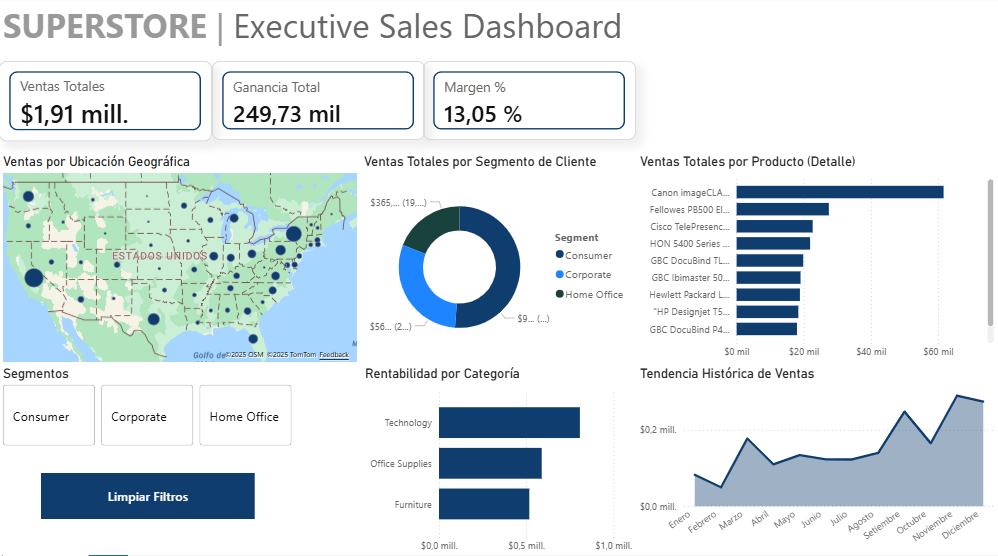

# 📊 Dashboard Ejecutivo de Ventas - Superstore (End-to-End)

## 📝 Resumen del Proyecto
Desarrollo de una solución integral de **Business Intelligence** para analizar el rendimiento de ventas y rentabilidad de una cadena de retail. El proyecto abarca desde la ingesta de datos crudos hasta la visualización de KPIs estratégicos, aplicando mejores prácticas de modelado de datos.

## 🖼️ Visualización del Dashboard

*> Nota: Dashboard optimizado para eliminar redundancias visuales y mejorar la profundidad del análisis por segmento.*

## 🏗️ Arquitectura de Datos y Modelado
Este proyecto implementa un **Modelo Estrella (Star Schema)** para optimizar el rendimiento de las consultas y la claridad del análisis:
* **Normalización SQL:** Transformación de datos planos a tablas de dimensiones y hechos.
* **Integridad Referencial:** Relaciones de tipo **Uno a Varios (1:*)** entre dimensiones y tablas de hechos.
* **Tablas de Dimensión:** `Dim_Customer`, `Dim_Product`, `Dim_Location` y una `Dim_Calendario` creada dinámicamente con DAX para análisis temporal.

## 🛠️ Stack Tecnológico
* **SQL Server:** Procesos ETL, limpieza y estructuración del esquema estrella.
* **Power BI:** Modelado de datos, inteligencia de tiempo y diseño UX/UI.
* **DAX (Data Analysis Expressions):** Creación de medidas clave:
    * **Ventas Totales:** `Total Sales = SUM(Fact_Sales[Sales])`
    * **Ganancia Total:** `Total Profit = SUM(Fact_Sales[Profit])`
    * **% Margen:** `% Margen = DIVIDE([Total Profit], [Total Sales], 0)`

## 📂 Estructura del Proyecto
* **`SQL_Scripts/`**: Creación de tablas, normalización y limpieza.
* **`Dashboard/`**: Archivo `.pbix` con el reporte interactivo.
* **`Documentacion/`**: [Descarga aquí la Documentación Técnica en PDF](./Documentacion/Documentación_Tecnica.pdf) con el detalle paso a paso.

## 💡 Insights Clave
* **Optimización Visual:** Se sustituyó un gráfico redundante de productos por un análisis de **Ventas por Segmento**, permitiendo identificar que el sector *Consumer* representa la mayor parte del volumen de ventas.
* **Rentabilidad por Categoría:** Identificación visual inmediata de categorías con márgenes bajos que requieren ajuste de precios.

---
👨‍💻 **Desarrollado por:** Julius Ormeño
